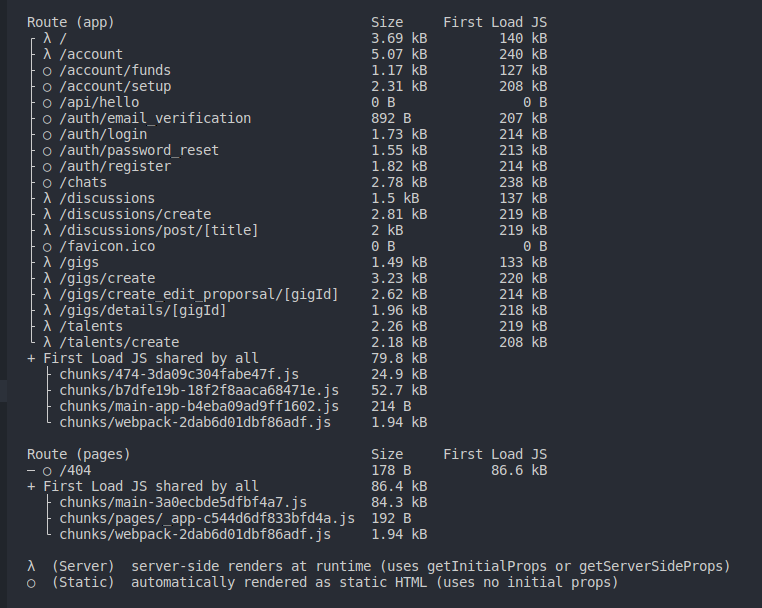

# Devonnex ~ _The global talent marketplace_

# Introduction

## The Project

[**Devonnex**](https://devonnex.tech/) is a community-driven freelancing platform designed exclusively for developers. It brings together a vibrant community of talented individuals where users can engage in posts, discussions, and showcase their skills and projects. With a user-friendly interface and intuitive features, Devonnex empowers developers to connect with potential clients, explore job opportunities, and discover exciting gigs. Whether you're a seasoned professional or just starting your freelancing journey, Devonnex provides a platform to showcase your talents, collaborate with like-minded individuals, and take your career to new heights.

## The Context

I've created this project to showcase my skills and passion for web development. It serves as a visual representation of my journey, allowing me to explore various technologies and design principles. Through this project, I hope to connect with fellow developers, employers, and collaborators who share my enthusiasm. Let's dive in and explore the possibilities together!

## Blog posts

After the development phase, I wrote multiple blog posts to reflect on the Devonnex journey.

- [Devonnex: Building a Freelancing Platform: Lessons Learned from Devonnex]()
- [Devonnex: Mastering React and Next.js: Best Practices and Proven Techniques]()
- [Devonnex: From Idea to Launch: A Step-by-Step Guide to Building and Deploying Web Applications]()

# Project Architecture Overview

The project follows a microservices-based architecture, utilizing different technologies for different components. Here's an overview of the architecture and its components:

1. Frontend Layer:
   The frontend layer is built using Next.js, a popular React framework. It handles the user interface, routing, and client-side rendering. The frontend communicates with the backend services through REST APIs and WebSocket for the chat functionality.

2. Authentication:
   Firebase is used for authentication and user management. It provides secure authentication methods, such as email/password, social logins, and JWT tokens. Firebase integrates with the frontend to handle user authentication and authorization.

3. Backend Layer:
   The backend layer is implemented using Rails, a powerful web application framework. Rails handles the business logic, data models, and communication with the database. It provides RESTful APIs for the frontend to interact with the backend services.

4. Database:
   The project utilizes a database system, which can be PostgreSQL, MySQL, or another compatible database engine. Rails ORM (Object-Relational Mapping) handles the interactions with the database, ensuring efficient data storage and retrieval.

5. Chat Backend:
   The chat functionality is implemented using Golang. It provides a scalable and real-time communication system for the chat feature. Golang leverages WebSocket technology to establish bi-directional communication between the clients and the server.

By utilizing microservices and separating concerns, the project architecture promotes modularity, scalability, and maintainability. Each component focuses on its specific responsibilities, allowing for independent development, testing, and deployment. The frontend communicates with the backend services through well-defined APIs, enabling loose coupling between the layers.

### Pages

The **Devonnex** application is built using Next.js and consists of various pages that form the user interface. Here are some of the key pages within the app:

# Installations and Deployment

**For detailed installation instructions, please refer to the installation guide available in each respective directory.**

To deploy Devonnex, follow the steps below:

- Provision three AWS EC2 instances on the Amazon Web Services (AWS) platform. Ensure that each instance has the necessary resources and security settings.

- Set up Docker on each EC2 instance. Docker enables containerization of the application components, providing a consistent and reproducible environment.

- Build Docker images for the Rails backend, Go chat backend, and Next.js frontend. Include all required dependencies and configurations in the images.

- Create Docker containers based on the built images. Ensure proper networking and port mappings to allow communication between containers.

- Configure Nginx on one of the EC2 instances to act as a reverse proxy. Nginx will handle incoming requests and route them to the appropriate backend or frontend container based on the URL path.

- Obtain SSL certificates for secure communication. Consider using Let's Encrypt or another certificate authority. Configure Nginx to enable HTTPS encryption.

- Set up appropriate security groups and firewall rules to control inbound and outbound traffic to the EC2 instances. This ensures a secure deployment environment.

- Test the deployment to verify that all components are running correctly and can communicate with each other. Perform thorough testing to identify and resolve any issues.

- Monitor the deployed application to ensure its availability and responsiveness. Set up monitoring tools and establish proactive alerting mechanisms.

## Known bugs

- Some transitions are not as fluid as expected, and due to API calls lag can be a bit off.
- Issue when viewing on mobile. Many of the assets become squished vertically.

# Acknowledgments

- [**Jack Herrington**](https://github.com/jherr): Thank you for providing guidance and mentorship, offering valuable insights, and sharing your expertise in the field of web development.

- Stack Overflow: I would like to acknowledge the Stack Overflow community for their wealth of knowledge and the countless solutions they have provided to programming queries.

- Online Tutorials and Documentation: I extend my appreciation to the authors and creators of online tutorials, blogs, and documentation that have been instrumental in expanding my understanding and enhancing my skills in web development.

- Friends and Family: I want to express my gratitude to my friends and family for their unwavering support, encouragement, and understanding throughout this journey.

- Open-source Community: Lastly, I am grateful to the open-source community for their contributions to the development of frameworks, libraries, and tools that have played a significant role in shaping this project.

# License

MIT License
